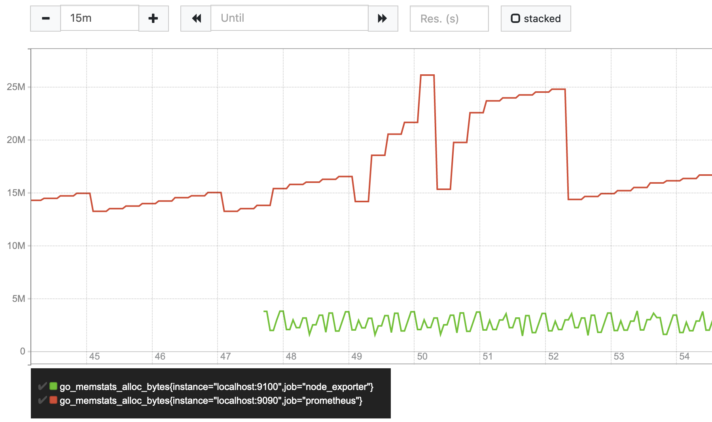
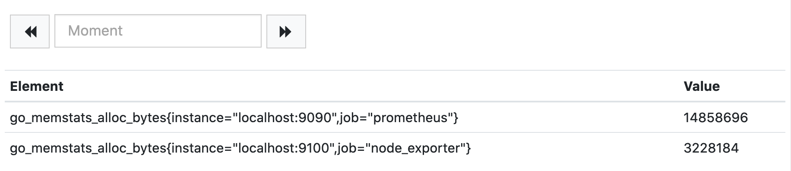
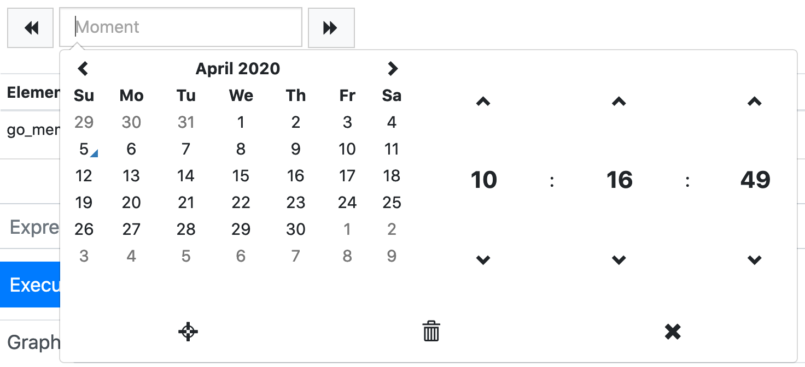
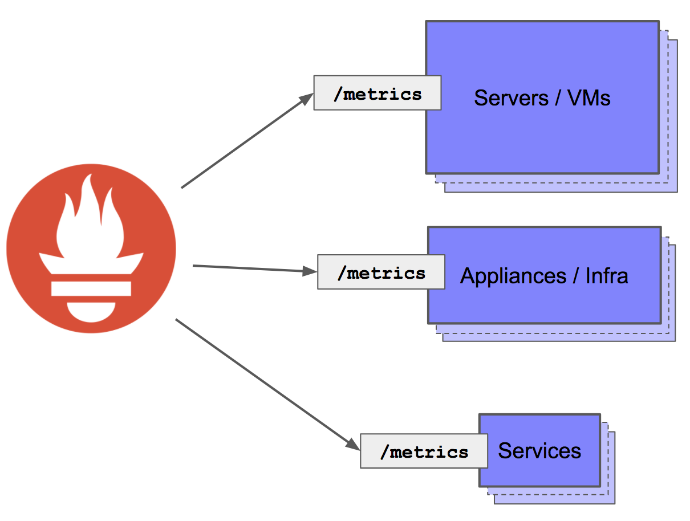
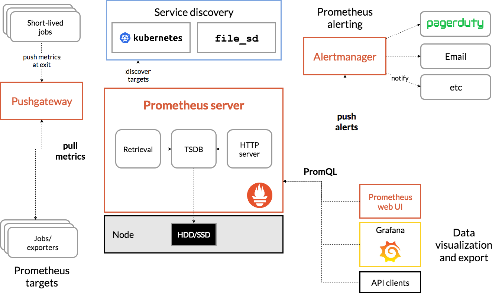
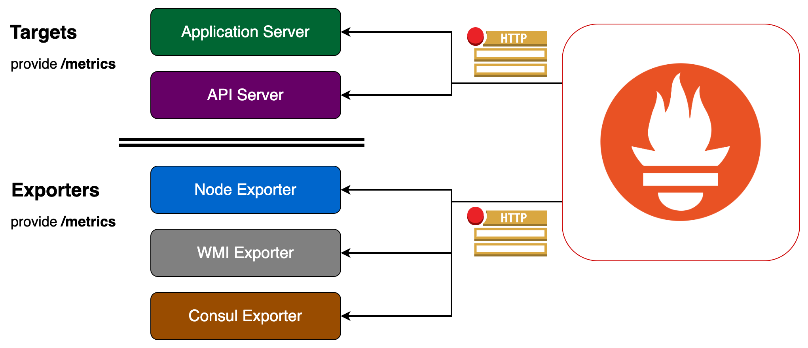

# Prometheus Introduction

> Prometheus collects metrics from configured targets at given intervals,
> evaluates rule expressions, displays the results,
> and can trigger alerts if some condition is observed to be true.

## Table of Contents

<!-- START doctoc generated TOC please keep comment here to allow auto update -->
<!-- DON'T EDIT THIS SECTION, INSTEAD RE-RUN doctoc TO UPDATE -->

- [Basic Concepts](#basic-concepts)
- [Collecting Metrics](#collecting-metrics)
- [Architecture](#architecture)
  - [Prometheus Storage](#prometheus-storage)
  - [Prometheus Exporters](#prometheus-exporters)
  - [Alertmanager](#alertmanager)
  - [Pushgateway](#pushgateway)
- [References](#references)

<!-- END doctoc generated TOC please keep comment here to allow auto update -->

## Basic Concepts

> Prometheus fundamentally stores all data as **time series**.

1. A multi-dimensional data model with **time series data**
   identified by **metric name** and **key/value pairs** (called **labels**).
1. `PromQL` (**Prometheus Query Language**),
   a flexible query language to leverage this dimensionality.

 

- **Notation**: `<metric name>{<label name>=<label value>, ...}`.
- **Metric name**: `go_memstats_alloc_bytes`.
- **Labels**: `instance="localhost:9100"`, `job="node_exporter"`, `instance="localhost:9090"`, `job="prometheus"`.

 

**Samples** form the actual time series data. Each **sample** consists of:

1. A **float64 value**.
1. A **millisecond-precision timestamp**.

## Collecting Metrics

> Time series collection happens via a **pull model** over **HTTP**.

  
   
  <em>
    Prometheus collects metrics from monitored targets
    by scraping /metrics HTTP endpoints
  </em>
   

 

- **Rather than using custom scripts** that check on particular services and systems,
  the **monitoring data itself is used**.
- **Scraping endpoints** is much more efficient than other mechanisms (e.g. 3rd-party agents).
- A **single Prometheus server** is able to
  ingest up to **one million samples per second** as several million time series.

## Architecture

  
   
  <em>Prometheus and Its Ecosystem</em>
   

 

- Prometheus and most of its components are written in [**Go**](https://golang.org/).
- The main **Prometheus Server** which scrapes and stores time series data.
- **TSDB**: Time Series Database.
- **Client Libraries** for instrumenting application code.
- Targets are discovered via **Service Discovery** or **Static Configuration**.

### Prometheus Storage

- Local time series database stores time series data in a custom format **on-disk**.
- Local storage is limited by single nodes in its scalability and durability.
  Instead of trying to solve clustered storage in Prometheus itself,
  Prometheus has a set of interfaces that allow integrating with **remote storage** systems.

### [Prometheus Exporters](https://prometheus.io/docs/instrumenting/exporters)

 

- [**Node Exporter**](https://github.com/prometheus/node_exporter)
  is a **Prometheus Exporter** for hardware and OS metrics exposed by `*NIX` kernels.
- [**WMI Exporter**](https://github.com/martinlindhe/wmi_exporter)
  is a **Prometheus Exporter** for Windows machines, using the `WMI` (Windows Management Instrumentation).
- [**Consul Exporter**](https://github.com/prometheus/consul_exporter)
  is a **Prometheus Exporter** for Consul metrics.

### [Alertmanager](https://github.com/prometheus/alertmanager)

- The **Alertmanager** handles alerts sent by the **Prometheus Server**.
- It takes care of **deduplicating**, **grouping**, and **routing** them
  to the correct receiver integrations (e.g. PagerDuty, Email,...).
- It also takes care of **silencing** and **inhibition** of alerts.

### [Pushgateway](https://github.com/prometheus/pushgateway)

- The **Pushgateway** exists to allow ephemeral and batch jobs to expose their metrics to Prometheus.
  Since these kinds of jobs may not exist long enough to be scraped,
  they can instead push their metrics to a **Pushgateway**.
- The **Pushgateway** then exposes these metrics to Prometheus.
- The **Pushgateway** is not capable of turning Prometheus into a **~~push-based~~** monitoring system.

## References

- [Prometheus Introduction](https://prometheus.io/docs/introduction/overview/)
- [Exposing and Collecting Metrics](https://blog.pvincent.io/2017/12/prometheus-blog-series-part-3-exposing-and-collecting-metrics/)
